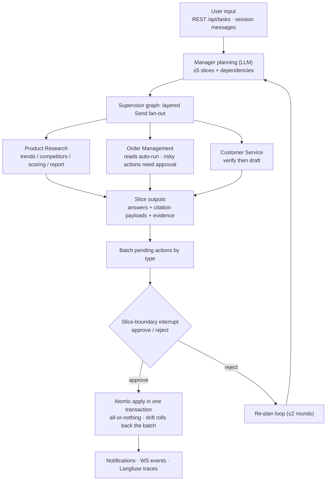

# Multi-Agent E-commerce System

[](https://github.com/moondream69/Multi-Agent-E-commerce-System/actions/workflows/ci.yml)
[](LICENSE)


[中文](README.md) | **English**

> Chat is the operation: the Manager plans slices, business agents execute, and outward-facing actions land through an approval guardrail.

A multi-agent operations console for cross-border e-commerce (China going global). A natural-language request is planned by the **Manager** into slices (≤5, with declared dependencies), fanned out layer by layer through a supervisor graph to three business agents — **Product Research / Order Management / Customer Service**. Every outward-visible high-risk action (listing, price changes, deletions, order transitions…) **does not take effect immediately**: parameters are captured as a snapshot, and only a human approval lands them — atomically, inside one transaction.

## ✨ Highlights

- 🛡️ **Effect deferral via approvals** — high-risk tool calls are recorded as parameter snapshots and have zero outward effect until approved; approval then applies them in a single transaction — **all-or-nothing per batch, with whole-batch rollback on snapshot drift**
- 🧭 **Manager planning + supervisor fan-out** — the LLM decomposes a request into a slice plan with dependencies, fanned out via `Send` to three domain subgraphs; slice boundaries can suspend and resume from checkpoint after an approval decision, surviving process restarts (durable interrupt)
- 🔍 **Clickable citations** — every `[n]` in an answer is a clickable superscript that opens a provenance card: chunk id, document title, publisher, page and chunk number. Citation sources come in two kinds — corpus hits (chunk-level) and system records (order/product lookups)
- 🚫 **No-fabrication guardrails** — zero retrieval hits blocks scoring/report/drafting; unknown facts are stated as "no such information found… cannot confirm"; inferences must be marked; unmatched products are explicitly labeled "unmatched (not fabricated)"
- 🧪 **Evaluation-driven quality** — golden scenarios (`docs/evals/*.yaml`) → real batch runs → **mechanical anti-fabrication checks + an LLM judge**, with snapshots and scores projected to Langfuse; every verdict is traceable
- 📡 **Observability end to end** — WebSocket event stream (task / slice / approval), a live collaboration pipeline, a notification bell, and hierarchical Langfuse traces

## 📸 Screenshots

### Cockpit — chat is the operation


The collaboration pipeline shows Manager planning and slice fan-out in real time (here `0/2 slices` running: order management executing, customer service waiting on slice #1); the middle column is the session messages and slice timeline (answers with citations); the sides show the business snapshot (orders / 7-day GMV / low stock) and the live event wall.

### Citation tracing — click any `[n]`


Clicking a citation superscript opens a provenance card: `usitc-global-digital-trade-1#142` (chunk id), document title, publisher, page and chunk number — every citation in an answer traces back to its source.

### Drafting workbench — verify first, draft second


Paste a buyer message (any language) plus an order number to generate a reply draft: `verify` runs before `draft`, the draft carries citation superscripts, and anything unresolvable is stated plainly ("no such information found… cannot promise a date"). In the evidence panel, unmatched products are labeled "unmatched (not fabricated)".

### Approval center — deferred effects, atomic batches


Each pending batch contains an execution report (factual conclusions plus honest caveats) and the pending action ("current: listed → delisted"). Decisions are made row by row and submitted as a batch; nothing changes before approval.

### Data console — read-only views, changes still go through chat


Read-only product/order views: multi-currency prices, stock-threshold markers, server-side filtering and pagination. The per-row "Ask Agent" button jumps back to the cockpit with the question pre-filled — outward state changes still go through chat + the approval guardrail (read-only boundary: ADR-0006).

## 🏗 Architecture



| Layer | Directory | Responsibility |
|---|---|---|
| API | `python-backend/src/python_backend/api/` | FastAPI endpoints + WS broadcast; all DB access goes through stores injected into `create_app` |
| Orchestration | `core/` | Manager planning, supervisor fan-out/batching/interrupts, approval batches, citation parsing, events, notification assembly |
| Agents | `agents/` | The three domain subgraphs + `ToolExecutor` (risk classes / parameter snapshots / transactional `apply`) |
| Data | `db/` · `vector_repo/` | PG models and per-domain stores; vector access abstraction (Milvus today, pgvector switchable) |
| Infrastructure | `infrastructure/` | LLM service (DeepSeek), Langfuse tracing, FX rates |
| Corpus | `corpus/` + `scripts/ingest_corpus.py` | Freeze / chunk / embed / project; **source of truth = `docs/corpus/*.yaml`** |
| Evaluation | `evals/` + `scripts/evals.py` | Snapshot projection, mechanical anti-fabrication checks, LLM judge scoring |

**Key decisions** ([ADRs](docs/adr/)):

| ADR | Topic |
|---|---|
| 0005 | Rebuild production charter (task context, approval guardrail, environment profiles) |
| 0006 | Read-only boundary for the data console |
| 0007 | Corpus source of truth and projection (the DB tables/collections are just projections of `docs/corpus/*.yaml`) |
| 0008 | Agent evaluation: golden scenarios and the judge |

## 🧩 Core Features

**Task line** — one sentence → a slice plan (a "coming up" preview rides along in approval envelopes) → domain subgraphs execute → results are summarized back into session messages. The collaboration is streamed as three events: `task.planned` / `slice.started` / `slice.completed`.

**Approval center** — three-tier risk classification; risky calls capture parameter snapshots (drift rolls back the whole batch); `create/decide` are idempotent and replay-safe; approved batches apply inside one transaction, and notifications are emitted only after commit.

**Customer service workbench** — a structured `verify → draft` pair: drafts are unreachable without verification; four verification routes (FAQ / knowledge search / orders / products); **all three evidence kinds share one numbering pool** with corpus citations; multi-language drafts; unknown facts are stated honestly rather than invented.

**Corpus & retrieval** — corpora live as YAML; chunk ids are derived deterministically (`<doc-id>#<index>`, overwrite by id, with tail cleanup); BGE-M3 embeddings (1024-d, via Ollama) go into Milvus; answers cite at chunk level, and unresolvable citation markers are left verbatim (anti-fabrication).

**Evaluation line** — golden scenarios (product reports / planning slices / customer drafts) → real task outputs snapshotted → mechanical checks (citation forgery) + LLM judge (per-criterion scores, including a third "not applicable" value) → scores projected to Langfuse. Batch runs and scoring are offline CLIs (`scripts/evals.py`), kept out of the fast test suite.

**Two profiles** — `ENVIRONMENT=dev` for rehearsal (shadow mode visible) / `prod` for production (approval locked); shadow visibility and the backfill endpoint gate derive from the profile and cannot be switched at runtime.

## 🚀 Getting Started

Prerequisites: Docker, Python 3.13 + [uv](https://docs.astral.sh/uv/), Node.js (for frontend dev), a local Ollama (embeddings: `ollama pull bge-m3`), and an OpenAI-compatible LLM key (DeepSeek by default).

```bash
cp .env.example .env        # fill in your LLM key etc.; embeddings default to local Ollama on :11434
docker compose up -d        # starts 9 services: Postgres/Redis/etcd/MinIO/Milvus/ClickHouse/Langfuse x2/app (build first time)

cd python-backend
uv run alembic upgrade head             # migrations (14 tables: 11 business + 3 corpus; checkpoint tables are created by PostgresSaver)
uv run python -m python_backend.run     # backend on :3000 (Windows must go through run.py; containers are managed by compose)

cd frontend && npm install && npm run dev   # frontend dev server on :5173
```

In its production form the frontend is served same-origin by the app image — just open `http://<host>:3000` (frontend + API on one port).

The admin user and demo buyer are seeded idempotently at startup (credentials from `AUTH_ADMIN_*` in `.env`).

**Demo data** (optional, deterministic seed):

```bash
cd python-backend
uv run python scripts/gen_synth_data.py                    # synthetic data: 500 products / 200 buyers / 2000 orders
uv run python -m python_backend.simulator --once           # simulated traffic: real HTTP through the full task/order flow (order hits take 30-90s)
```

## 🧰 Tech Stack

FastAPI + LangGraph · PostgreSQL 16 (vectors live in Milvus, not PG) · Redis 7 · Milvus 2.6 (etcd/MinIO) · ClickHouse + Langfuse v3 (observability) · DeepSeek (LLM) · BGE-M3 via Ollama (embeddings, 1024-d) · python-socketio (WS) · React 19 + Vite + socket.io-client · uv / pytest / ruff / ty · vitest / ESLint / Prettier

## 📚 Documentation Map

| Path | Contents |
|---|---|
| [`CONTEXT.md`](CONTEXT.md) | Glossary (target state; authoritative) |
| [`docs/adr/`](docs/adr/) | Architecture decision records (0001–0008) |
| [`docs/OPERATIONS.md`](docs/OPERATIONS.md) | Operations manual: startup, backup/restore, corpus supply, trial-run data provisioning |
| [`docs/acceptance-scenarios.md`](docs/acceptance-scenarios.md) | Acceptance baseline (A/B scenario checklist) |
| [`docs/evals/`](docs/evals/) | Golden evaluation scenarios |
| [`docs/corpus/`](docs/corpus/) | Corpus sources (FAQ / market intelligence) |
| [`CLAUDE.md`](CLAUDE.md) | Dev commands and conventions (entry point for AI sessions) |

## License

[MIT](LICENSE)
