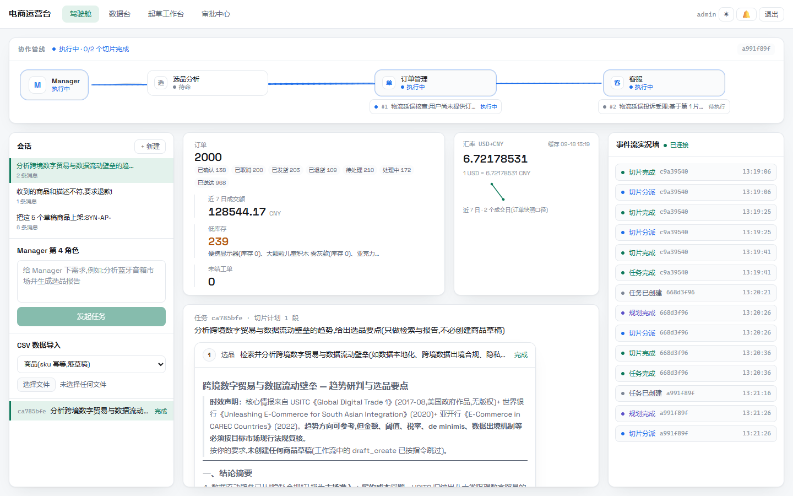
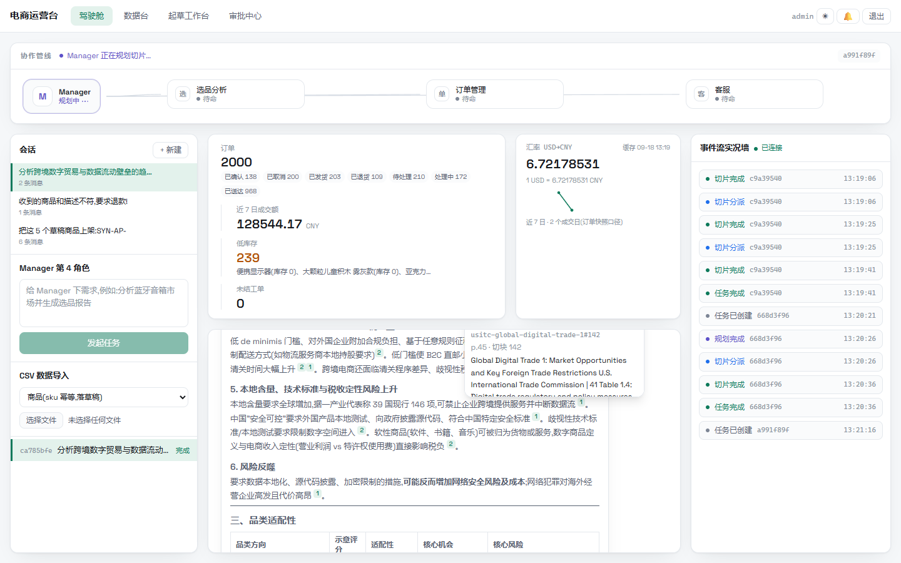
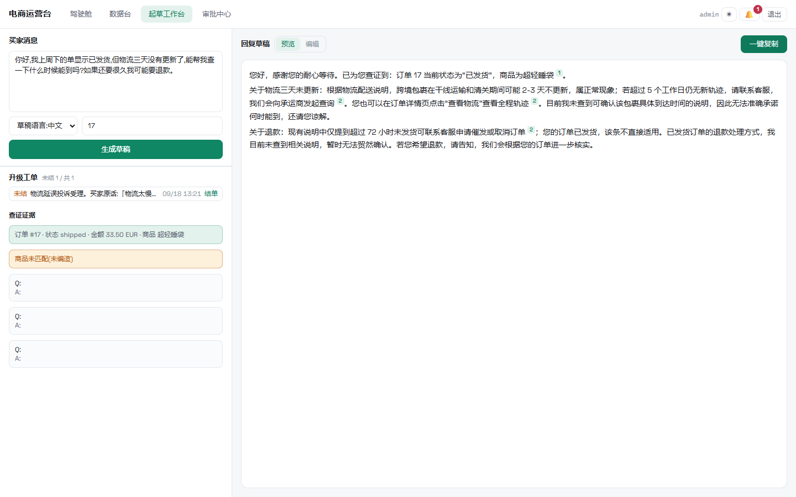
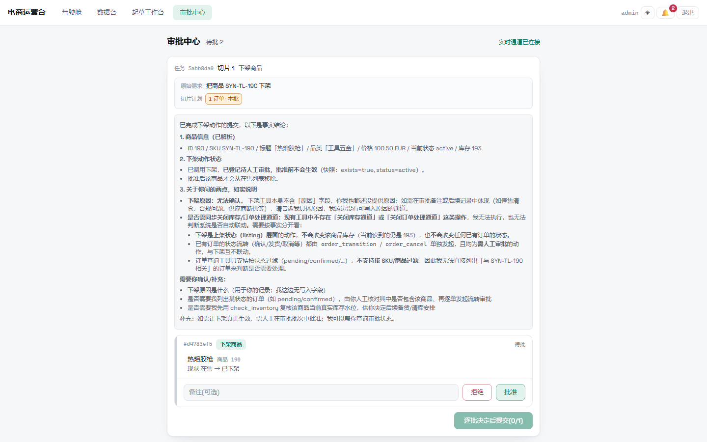
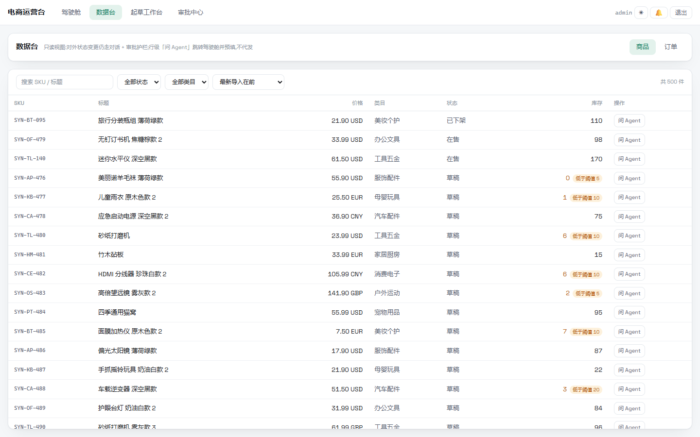
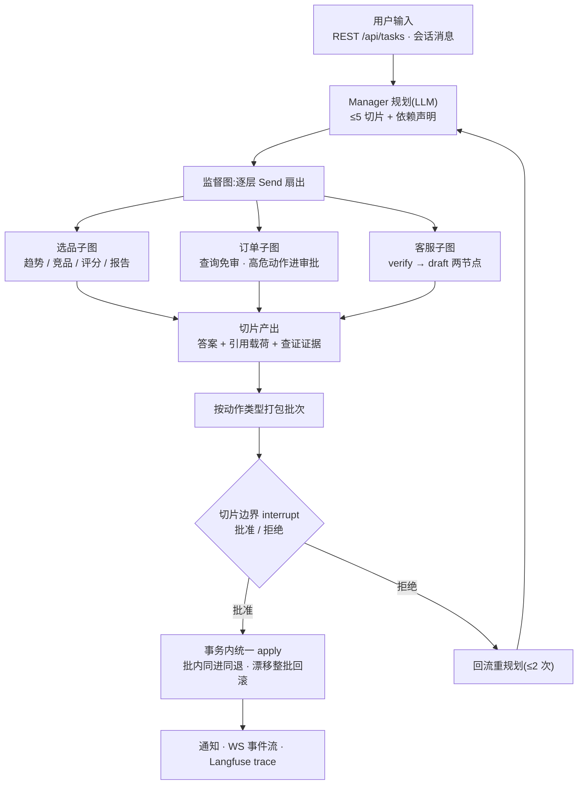

# Multi-Agent 跨境电商系统

[](https://github.com/moondream69/Multi-Agent-E-commerce-System/actions/workflows/ci.yml)
[](LICENSE)


**中文** | [English](README.en.md)

> 对话即操作:Manager 规划切片,业务 Agent 执行,对外动作经审批护栏落地。

多 Agent 协作的跨境电商运营台(中国出海场景)。用户的自然语言请求经 **Manager 规划**为切片计划(≤5 片,含依赖声明),由**选品 / 订单 / 客服**三个业务 Agent 在监督图中逐层扇出执行;一切对外可见的高危动作(上架、改价、删单、订单流转…)**不立即生效**——登记参数快照,人工批准后在事务内统一落地。

## ✨ 亮点

- 🛡️ **审批效果后置** —— 高危动作调用后只登记参数快照,不产生任何对外效果;人工批准后在一个事务里统一 apply,**批内同进同退、快照漂移整批回滚**
- 🧭 **Manager 规划 + 监督图扇出** —— LLM 把需求拆成带依赖声明的切片计划,逐层 `Send` 扇出到三域子图;切片边界可挂起,审批决定后从断点恢复,跨进程重启不丢状态(durable interrupt)
- 🔍 **引用可点开溯源** —— 回答里的 `[n]` 是可点上标,点开即见溯源卡片:切块标识、文档标题、发布机构、页码与切块号;引用源分两类——语料命中(切块级)与系统记录(订单/商品查库结果)
- 🚫 **不编造的护栏** —— 检索零命中不得执行评分/报告/起草;查不到就写「未查到相关说明…无法贸然确认」;推断必须标「推断:」;查无商品即标「未匹配(未编造)」
- 🧪 **评测驱动质量** —— 金标场景真源(`docs/evals/*.yaml`)→ 真实跑批 → **机械防伪引 + LLM judge 双线判分**,分数与快照投影 Langfuse,每条判据的判定有据可查
- 📡 **全程可观测** —— WebSocket 实时事件流(任务/切片/审批三级事件)、协作管线动画、通知铃铛、Langfuse trace 层级

## 📸 界面巡览

### 驾驶舱 —— 对话即操作



协作管线实时呈现 Manager 规划与切片扇出(图中 `0/2 切片` 执行中:订单管理执行中、客服基于第 1 片待执行);中间是会话消息与切片时间线(切片计划的答案与引用);两侧是经营快照(订单/近 7 日成交额/低库存)与事件流实况墙。

### 引用溯源 —— 点开每一个 `[n]`



点开正文里的引用小标,弹出溯源卡片:`usitc-global-digital-trade-1#142`(切块标识)、文档标题、发布机构、页码与切块号——回答里每个引用都能这样回溯到原文。

### 客服起草工作台 —— 查证先行,草稿后置



粘贴买家消息(任意语言)与订单号即可生成回复草稿:先 `verify`(查证)后 `draft`(起草),草稿带引用小标;查不到的信息主动写明「未查到…无法准确承诺」。左下查证证据区中,查无商品的项会明确标「未匹配(未编造)」。

### 审批中心 —— 效果后置,批内同进同退



待批批次里是执行报告(事实结论 + 如实说明)与待批动作(「现状 在售 → 已下架」);人工逐条决定后整批提交,批准前商品状态不会发生任何变化。

### 数据台 —— 只读视图,变更仍走对话



商品/订单只读视图:多币种价格、库存阈值标记、服务端筛选分页;行级「问 Agent」跳回驾驶舱并预填,对外状态变更仍然走对话 + 审批护栏(只读边界见 ADR-0006)。

## 🏗 架构



| 层 | 目录 | 职责 |
|---|---|---|
| API | `python-backend/src/python_backend/api/` | FastAPI 端点族 + WS 广播;触库一律经 `create_app` 注入的 store 缝 |
| 编排 | `core/` | Manager 规划、监督图扇出/批次/interrupt、审批批次、引用解析、事件、通知组装 |
| Agent | `agents/` | 三个业务子图 + `ToolExecutor`(风险分类 / 参数快照 / 事务内 `apply`) |
| 数据 | `db/` · `vector_repo/` | PG 模型与各域 Store;向量访问抽象(Milvus 实现,pgvector 可切换) |
| 基础设施 | `infrastructure/` | LLM 服务(DeepSeek)、Langfuse 追踪、汇率 |
| 语料 | `corpus/` + `scripts/ingest_corpus.py` | 冻结 / 切块 / 嵌入 / 投影;**真源 = `docs/corpus/*.yaml`** |
| 评测 | `evals/` + `scripts/evals.py` | 快照投影、机械防伪引、LLM judge 判分 |

**关键设计决策**([ADR](docs/adr/)):

| ADR | 主题 |
|---|---|
| 0005 | 架构重建生产宪章(任务上下文、审批护栏、环境剖面) |
| 0006 | 数据台只读边界(编辑诉求须另立 ADR) |
| 0007 | 语料真源与投影(库内两表两集合只是 `docs/corpus/*.yaml` 的投影) |
| 0008 | Agent 评测:金标场景与 judge |

## 🧩 核心功能

**任务线** —— 一句话需求 → 切片计划(可在审批信封里预览「后续计划」)→ 三域子图执行 → 汇总为会话消息;协作轨迹以 `task.planned` / `slice.started` / `slice.completed` 三事件实时推送。

**审批中心** —— 三层风险分类;审批动作收集参数快照(快照漂移整批回滚);`create/decide` 幂等、重放安全;批准后事务内统一执行,产生对外效果时在提交后发出通知。

**客服工作台** —— 结构化 `verify → draft` 两节点:未查证不可达草稿;FAQ / 知识检索 / 订单 / 商品四路查证;**三类证据统一编号**(与语料引用同池编号);支持多语言草稿;查不到就如实说明,不编造。

**语料与检索** —— 语料以 YAML 为真源,切块标识确定性派生(`<文档标识>#<序号>`,同 id 覆盖、含清尾);BGE-M3(1024 维,Ollama)嵌入入 Milvus;回答按切块级溯源,引用解析不到时标记原样保留(机械防伪引)。

**评测线** —— 金标场景(选品报告 / 规划切片 / 客服草稿三线)→ 真实任务产出快照 → 机械线(防伪引)+ judge 线(逐判据打分,含「不适用」第三值)→ 分数投影 Langfuse;跑批/判分是离线 CLI(`scripts/evals.py`),不进快速测试套件。

**双剖面** —— `ENVIRONMENT=dev` 演练(影子模式)/ `prod` 生产(审批锁死);影子段的可见性与补执行端点的开关由剖面派生,运行时不可切换。

## 🚀 快速开始

前置:Docker、Python 3.13 + [uv](https://docs.astral.sh/uv/)、Node.js(前端开发态)、本机 Ollama(Embedding,`ollama pull bge-m3`)、以及一个 OpenAI 兼容的 LLM Key(默认 DeepSeek)。

```bash
cp .env.example .env        # 填入 LLM key 等;Embedding 默认指向本机 Ollama:11434
docker compose up -d        # 起 9 服务:Postgres/Redis/etcd/MinIO/Milvus/ClickHouse/Langfuse×2/app(首次先 docker compose build)

cd python-backend
uv run alembic upgrade head             # 数据库迁移(14 张表:11 业务 + 3 语料;checkpoint 表由 PostgresSaver 自建)
uv run python -m python_backend.run     # 本机起后端 :3000(Windows 必走 run.py;容器方案由 compose 托管)

cd frontend && npm install && npm run dev   # 前端开发态 :5173
```

生产形态前端已随 app 镜像同源托管——浏览器直接开 `http://<主机>:3000` 即可(前端 + API 同端口)。

管理员与演示买家由应用启动时幂等 seed(凭据取 `.env` 的 `AUTH_ADMIN_*`)。

**造演示数据**(可选,确定性 seed):

```bash
cd python-backend
uv run python scripts/gen_synth_data.py                    # 合成数据:500 商品 / 200 买家 / 2000 订单
uv run python -m python_backend.simulator --once           # 模拟流量:真实 HTTP 入口走完整任务/下单链路(命中下单会等 30-90s)
```

## 🧰 技术栈

FastAPI + LangGraph · PostgreSQL 16(向量在 Milvus,不入 PG) · Redis 7 · Milvus 2.6(etcd/MinIO) · ClickHouse + Langfuse v3(观测) · DeepSeek(LLM)· BGE-M3 via Ollama(Embedding,1024 维)· python-socketio(WS) · React 19 + Vite + socket.io-client · uv / pytest / ruff / ty · vitest / ESLint / Prettier

## 📚 文档地图

| 路径 | 内容 |
|---|---|
| [`CONTEXT.md`](CONTEXT.md) | 术语表(目标态,以它为准) |
| [`docs/adr/`](docs/adr/) | 架构决策记录(0001–0008) |
| [`docs/OPERATIONS.md`](docs/OPERATIONS.md) | 运维手册:启动、备份/恢复、语料供给、试运行数据 provisioning |
| [`docs/acceptance-scenarios.md`](docs/acceptance-scenarios.md) | 验收基线(A/B 场景清单) |
| [`docs/evals/`](docs/evals/) | 评测金标场景真源 |
| [`docs/corpus/`](docs/corpus/) | 语料真源(FAQ / 市场情报) |
| [`CLAUDE.md`](CLAUDE.md) | 开发命令与约定(AI 会话入口) |

## License

[MIT](LICENSE)
